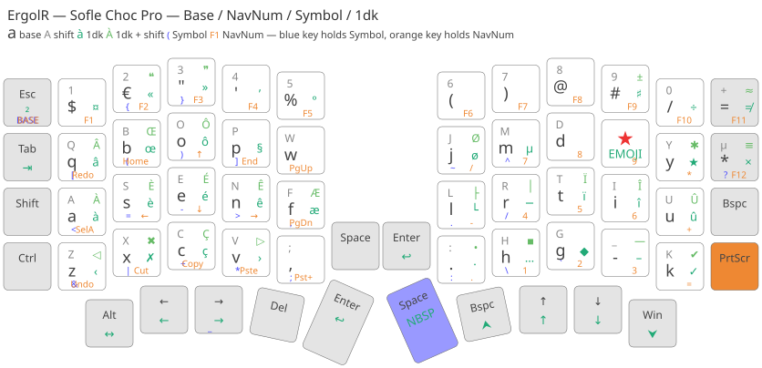
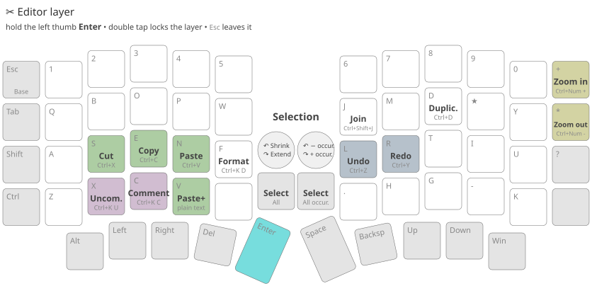
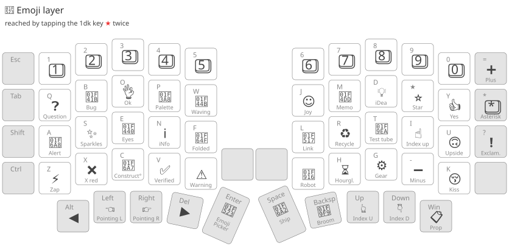

# ErgolR — Sofle

---

A French-first ergonomic keyboard layout for a 4×6 split column-staggered board, currently a [Keebart Sofle Choc Pro](https://www.keebart.com/products/sofle).

ErgolR is a personal fork of [Ergo-L](https://ergol.org/): same core idea — an optimised letter arrangement plus a one-shot dead key (1dk) for everything accented or typographic — reshaped for a 40-ish % split keyboard, and for the habits of an AZERTY touch typist who writes code all day.

## Inspirations

- [Ergo-L](https://ergol.org/) letter arrangement and its 1dk one-shot dead key that carries the accents.
- [Glove80 / MoErgo](https://docs.moergo.com/glove80-user-guide/) Keypad/Lower layer, its hold tap principle to access layers - see the ErgoLR [layout](https://my.moergo.com/glove80/#/search?tags=ergo-lr)
- [TailorKey](https://sites.google.com/view/tailorkey/moergo/go60) AutoShift, its Symbol layer, its F-Key combos

## Where the code lives

This repository holds the design material. The firmware is a QMK keymap in a [Vial-QMK fork](https://github.com/rdeneau/vial-qmk-keebart/keyboards/keebart/sofle_choc_pro/keymaps/vial_rde/).

## Deviations from Ergo-L, and why

The letter core is Ergo-L. Everything below is a deliberate departure.

### Muscle memory from AZERTY wins

Twenty years of AZERTY is not worth re-learning away when the gain is marginal.

- **<kbd>x</kbd> <kbd>c</kbd> <kbd>v</kbd> stay side by side on the bottom row**, in that order, exactly where AZERTY puts them. Cut, copy and paste are chorded hundreds of times a day; moving them costs more than any letter-frequency gain returns.
- **<kbd>c</kbd> displaces <kbd>b</kbd>**, which moves up between <kbd>q</kbd> and <kbd>o</kbd>.
- **<kbd>= / +</kbd> sits at the end of the digit row**, where AZERTY has it.
- **<kbd>"</kbd> on <kbd>3</kbd> and <kbd>'</kbd> on <kbd>4</kbd>** follow the AZERTY digit row instead of Ergo-L's `«` and `»`, which move down to the 1dk layer of that same row.

### A digit row rebuilt around what I actually type

- `$` on <kbd>1</kbd> rather than <kbd>4</kbd>.
- `€` on <kbd>2</kbd> rather than <kbd>1</kbd>.
- `(` and `)` on <kbd>6</kbd> and <kbd>7</kbd>, as a pair, rather than scattered; `&` and `^` are left to the Symbol layer.
- `@` on <kbd>8</kbd> rather than <kbd>9</kbd>.
- `#` on <kbd>9</kbd> — a character I type constantly, naming C# and F#. Its 1dk gives `♯`, the music sharp sign those two names are actually pronounced with.
- `°` on <kbd>0</kbd>, taking the slot `/` used to hold: the slash is easier to reach on the Symbol layer, with `\` right underneath it.

### Three new typo key pairs

- <kbd>, / ;</kbd> replaces <kbd>b</kbd> on the bottom row, mirroring <kbd>. / :</kbd> on the other half.
- <kbd>- / _</kbd> takes the slot <kbd>, / ;</kbd> left free, between <kbd>g</kbd> and <kbd>k</kbd>.
- <kbd>? / !</kbd> ends the right outer column, under <kbd>* / µ</kbd>, where a second <kbd>Backspace</kbd> would only have duplicated the thumb.

### A 1dk layer that keeps room for symbols

It carries fewer accented characters than a full French set, which frees space for typography and box-drawing characters.
The common ones sit on their own vowel: `é` on <kbd>e</kbd>, `î` on <kbd>i</kbd>, `û` on <kbd>u</kbd>, `à` on <kbd>a</kbd>, `ç` on <kbd>c</kbd>.
The other ones are placed on the left or/and on the right of their base key, except for the <kbd>a</kbd>, with a double exception: `â` is placed above its key — to preserve <kbd>Shift</kbd> on the left — and `æ` lands on <kbd>f</kbd>, right after the run of e-s (`è` `é` `ê`).

Special characters follow the same likeness/mnemonic rule: the currency symbol `¤` on <kbd>$ 1</kbd>, the guillemets on the double-quote keys, the apostrophe `’` on the quote key, `‰` next to `%`, `±` `≠` `≈` `≡` around to <kbd>= +</kbd>, `×` on <kbd>* µ</kbd>, `§` on <kbd>p</kbd> (as in *paragraph*) with `¶` next to it on <kbd>w</kbd>, `♯` on <kbd>#</kbd>, `µ` on <kbd>m</kbd>, `÷` on <kbd>d</kbd> (as in *divide*), a literal Tab character on the <kbd>Tab</kbd> key, `x` on <kbd>x</kbd>, `✓` on <kbd>k</kbd> (as in o*K*), `· •` on <kbd>.</kbd>, `…` on its right, `– —` (EN and EM dashes) on <kbd>- _</kbd>.
That last Tab is a real U+0009 sent through WinCompose, not <kbd>Tab</kbd> under another name: an editor is free to turn the key itself into an indent, a completion or a focus change, and VS Code does.

## Layers

| #   | Name       | Reached by             | Holds                                                                        |
| --- | ---------- | ---------------------- | ---------------------------------------------------------------------------- |
| 0   | **Base**   | <kbd>Esc</kbd>         | The ErgolR letters, the digit row, the editing thumbs.                       |
| 1   | **NavNum** | <kbd>PrtScr</kbd>      | F1–F12, navigation, a numeric keypad on the right half.                     |
| 2   | **Symbol** | <kbd>Space</kbd>       | Brackets, operators, punctuation.                                            |
| 3   | **1dk**    | the <kbd>★</kbd> key   | Accents and typography; Shift reaches the second glyph of each pair.         |
| 4   | **Emoji**  | tap <kbd>★</kbd> twice | Emoji, as the Glove80's third dead key; the digit row holds the keycaps.     |
| 5   | **Editor** | <kbd>Enter</kbd>       | Undo, redo, the clipboard, format, duplicate; the knobs work the selection. |

### Hold, double tap, and the way out

The three thumb-reachable layers are all reached by holding one key:

| Action on <kbd>PrtScr</kbd> / <kbd>Space</kbd> / <kbd>Enter</kbd> | Result                                                          |
| ----------------------------------------------------------------- | ----------------------------------------------------------------- |
| tap                                                               | <kbd>PrtScr</kbd> / a space / a newline                         |
| hold                                                              | NavNum / Symbol / Editor, for as long as the key is held (`MO`) |
| double tap                                                        | NavNum / Editor locked (`TG`) — **not Symbol**                  |

<kbd>Space</kbd> is the right thumb key and <kbd>Enter</kbd> the left one, so the two layers a programmer reaches most often sit under one thumb each.

#### Why Symbol has no lock

A double tap can only be told apart from a single one by waiting: the tap has to be held back until the window closes, or a double tap would emit a space before locking the layer.
That wait is a delay on **every** tap of the key, and it is the reason Symbol does not get one.

Symbol is the only layer reached in the middle of a typing flow — the symbols it holds are typed between words, and its key is the space bar.
A space that arrives a fifth of a second late, or after the letter that followed it, is unusable, so the key is a plain layer tap: the space leaves on release and nothing is ever held back.

NavNum and Editor are the opposite.
They are used *outside* a flow — a run of digits typed as a block, a series of editor shortcuts — never one keystroke slipped between two words.
The digit row already covers the isolated digit.
There the lock is what makes the layer worth having, and the delay on <kbd>PrtScr</kbd> and <kbd>Enter</kbd> is a price paid where nothing is flowing.

<kbd>Esc</kbd> leaves a locked layer and returns to Base.
That is also what the RGB tells you: every layer lights the same static map, and **the <kbd>Esc</kbd> key alone says which layer is active** — white on Base, orange on NavNum, blue on Symbol, red on 1dk, violet on Emoji, cyan on Editor.
The <kbd>PrtScr</kbd> key stays orange, the right-thumb <kbd>Space</kbd> blue and the left-thumb <kbd>Enter</kbd> cyan on every layer, as a reminder of which key reaches which.

### The Symbol layer, and why the operators sit where they do

The Symbol layer follows [Sunaku's symbol layer](https://sunaku.github.io/moergo-glove80-keyboard.html#symbol-layer) for the Glove80: rather than scattering the operators, put the characters that go *together* next to each other, so the digraphs a programmer types all day become one inward roll instead of two hunted keys.

The left home row carries the four characters every arrow is made of, in that order:

| <kbd>a</kbd> | <kbd>s</kbd> | <kbd>e</kbd> | <kbd>n</kbd> |
| ------------ | ------------ | ------------ | ------------ |
| `<`          | `=`          | `-`          | `>`          |

From there the arrows write themselves, all on that one row, most of them rolling inward towards the index:

- `->` thin arrow — <kbd>e</kbd> <kbd>n</kbd>
- `=>` fat arrow, the F# and C# lambda — <kbd>s</kbd> <kbd>n</kbd>
- `<-` — <kbd>a</kbd> <kbd>e</kbd>
- `<=` `>=` — the same two keys, either way round
- `|>` the F# pipe — <kbd>x</kbd> <kbd>n</kbd>, one row down then back up

The row below holds `&` `|` `+` `*` on <kbd>z</kbd> <kbd>x</kbd> <kbd>c</kbd> <kbd>v</kbd>, which is what puts `|` under the arrow row and makes `|>` and `||` cheap.

The brackets nest outwards from the middle of the row above, `(` and `)` on the two index-adjacent keys and `[` `]` around them, with `{` `}` one row higher still:

| <kbd>q</kbd> | <kbd>b</kbd> | <kbd>o</kbd> | <kbd>p</kbd> |
| ------------ | ------------ | ------------ | ------------ |
| `[`          | `(`          | `)`          | `]`          |

The right half keeps the punctuation — `.` `/` `:` `\` `!` `?` — plus `~` and `^`.

### The backtick

On the Symbol layer the backtick is the plain AZERTY <kbd>AltGr</kbd>+<kbd>7</kbd>, which is a **dead** grave accent, and it behaves exactly as it does on a standard AZERTY ISO keyboard.

- <kbd>\`</kbd>+<kbd>Space</kbd> → backtick literal
- <kbd>\`</kbd>+<kbd>\`</kbd> → double-backtick

Nothing in the firmware pre-composes those sequences: the dead key is the intended behaviour, not a limitation to work around.

`^` and `~` are the opposite call.
They are dead keys on AZERTY too — <kbd>AltGr</kbd>+<kbd>9</kbd> and <kbd>AltGr</kbd>+<kbd>2</kbd> — but nothing on this layout needs `ê` or `ñ` from them, the 1dk layer already owns the accented letters.
So the firmware taps the space itself and one tap types one character.

### The Editor layer

The Editor layer carries the shortcuts a keyboard cannot reach in one stroke.
It is the Glove80's Cursor layer minus its navigation: NavNum already holds the arrows, Home, End and the page keys, and a second copy would only be a second thing to remember.

Cut, copy and paste sit on the left home row, on <kbd>s</kbd> <kbd>e</kbd> <kbd>n</kbd>, in that order under three fingers — so the chords typed hundreds of times a day become one roll instead of a stretch — and <kbd>v</kbd> pastes as plain text, one row below paste.
Undo and redo went to the right hand, on <kbd>l</kbd> and <kbd>r</kbd>: the layer is held by the *left* thumb, so the left hand is the busy one, and left reads as back, right as forward.
Comment and uncomment sit on <kbd>c</kbd> and <kbd>x</kbd>, sharing their <kbd>Ctrl</kbd>+<kbd>K</kbd> prefix with format on <kbd>f</kbd>.
The rest of the layer is what an editor adds on top: <kbd>f</kbd> formats the document, <kbd>d</kbd> duplicates the line or selection, and <kbd>j</kbd> joins lines.
Select all, open and print left the layer: <kbd>Ctrl</kbd>+<kbd>A</kbd>, <kbd>Ctrl</kbd>+<kbd>O</kbd> and <kbd>Ctrl</kbd>+<kbd>P</kbd> are one stroke either way, and select all is still under the left knob push.

| Key                | Sends                                                      | Does                            |
| ------------------ | ---------------------------------------------------------- | ------------------------------- |
| <kbd>s</kbd>       | <kbd>Ctrl</kbd>+<kbd>X</kbd>                               | Cut                             |
| <kbd>e</kbd>       | <kbd>Ctrl</kbd>+<kbd>C</kbd>                               | Copy                            |
| <kbd>n</kbd>       | <kbd>Ctrl</kbd>+<kbd>V</kbd>                               | Paste                           |
| <kbd>v</kbd>       | <kbd>Win</kbd>+<kbd>Ctrl</kbd>+<kbd>Alt</kbd>+<kbd>V</kbd> | Paste as plain text             |
| <kbd>l</kbd>       | <kbd>Ctrl</kbd>+<kbd>Z</kbd>                               | Undo                            |
| <kbd>r</kbd>       | <kbd>Ctrl</kbd>+<kbd>Y</kbd>                               | Redo                            |
| <kbd>c</kbd>       | <kbd>Ctrl</kbd>+<kbd>K</kbd>, <kbd>Ctrl</kbd>+<kbd>C</kbd> | Comment the selection           |
| <kbd>x</kbd>       | <kbd>Ctrl</kbd>+<kbd>K</kbd>, <kbd>Ctrl</kbd>+<kbd>U</kbd> | Uncomment the selection         |
| <kbd>f</kbd>       | <kbd>Ctrl</kbd>+<kbd>K</kbd>, <kbd>Ctrl</kbd>+<kbd>D</kbd> | Format the document             |
| <kbd>d</kbd>       | <kbd>Ctrl</kbd>+<kbd>D</kbd>                               | Duplicate the line or selection |
| <kbd>j</kbd>       | <kbd>Ctrl</kbd>+<kbd>Shift</kbd>+<kbd>J</kbd>              | Join lines                      |

The two knobs work the selection, and each one pushes into the key drawn right under it:

| Knob  | Turn left                                      | Turn right                                   | Push                                                          |
| ----- | ---------------------------------------------- | -------------------------------------------- | ------------------------------------------------------------- |
| left  | <kbd>Alt</kbd>+<kbd>Shift</kbd>+<kbd>←</kbd> — shrink | <kbd>Alt</kbd>+<kbd>Shift</kbd>+<kbd>→</kbd> — extend | <kbd>Ctrl</kbd>+<kbd>A</kbd> — select all                          |
| right | <kbd>Alt</kbd>+<kbd>Shift</kbd>+<kbd>F3</kbd> — one occurrence less | <kbd>Alt</kbd>+<kbd>F3</kbd> — one occurrence more | <kbd>Ctrl</kbd>+<kbd>Alt</kbd>+<kbd>F3</kbd> — select all occurrences |

Those three F3 chords are **personal bindings**, not editor defaults:

- Rider — *Unselect Occurrence* / *Add Selection for Next Occurrence* / *Select All Occurrences*
- VS Code — *Undo Last Cursor* / *Add Selection To Next Find Match* / *Change All Occurrences*

### The knobs

Both encoders sit in the gap between the halves, each one directly above the key that is its own push switch — <kbd>Space</kbd> on the left, <kbd>Enter</kbd> on the right.
The left knob always moves horizontally and the right one vertically, matching the thumbs: <kbd>←</kbd> <kbd>→</kbd> are on the left thumb, <kbd>↑</kbd> <kbd>↓</kbd> on the right one.

| Layer  | Left knob      | Right knob         | Left push    | Right push          |
| ------ | -------------- | ------------------ | ------------ | ------------------- |
| Base   | caret left / right | caret up / down | a space      | a newline           |
| NavNum | scroll left / right | scroll up / down | —        | —                   |
| Symbol | volume down / up | previous / next track | mute      | play / pause        |
| Editor | shrink / extend the selection | one occurrence less / more | select all | select all occurrences |

### Parallels between the layers

Several keys mean the same thing on every layer they appear on, which is most of what makes the layout memorable.

| Key                                      | 1dk                             |
| ---------------------------------------- | ------------------------------- |
| **Arrows**                               |                                 |
| <kbd>Alt</kbd> <kbd>←</kbd> <kbd>→</kbd> | `↔` / `⟺`, `←` / `⇐`, `→` / `⇒` |
| <kbd>↑</kbd> <kbd>↓</kbd>                | `↑` / `⇑` • `↓` / `⇓`           |
| **Typo**                                 |                                 |
| <kbd>Enter</kbd>                         | `↩`                             |
| <kbd>Space</kbd>                         | `NBSP` non-breaking space       |
| <kbd>. / :</kbd>                         | `·` (middle-dot) / `•` (bullet) |
| <kbd>- / _</kbd>                         | `–` (EN dash) / `—` (EM dash)   |

The arrow keys give arrow characters, Enter gives the return arrow, Space gives the unbreakable space.
Nothing to memorise beyond "the 1dk layer says the same thing in Unicode".

## Shift, Caps Lock and Auto Shift

Every key carrying two glyphs picks the second one under **<kbd>Shift</kbd> or <kbd>Caps Lock</kbd>** — the digit row, <kbd>, / ;</kbd>, <kbd>. / :</kbd>, <kbd>- / _</kbd>, <kbd>? / !</kbd>, and the whole 1dk layer, where Shift turns `à` into `À` and `«` into `❝`.

**Auto Shift** is on, so *holding* a key is a third way to reach that second glyph — no Shift needed.
It covers the letters (accented ones included, through the 1dk layer) and the dual-glyph keys of the digit row.
It stays on under the other modifiers, which is what makes <kbd>Ctrl</kbd>+hold <kbd>p</kbd> reach <kbd>Ctrl</kbd>+<kbd>Shift</kbd>+<kbd>P</kbd>, and <kbd>Win</kbd>+hold <kbd>,</kbd> open the Windows emoji picker.

**Double tap <kbd>Shift</kbd>** switches <kbd>Caps Lock</kbd> on; once it is on, a single tap switches it back off.
A tap here means a press and release with no other key in between, so a <kbd>Shift</kbd> used as a modifier never triggers it.

Caps Lock is handled explicitly rather than left to the host: the French Windows layout inverts the digit row under Caps Lock, and that inversion is undone so the pairs stay literal.

## The three lives of ErgolR

| #   | Board           | What the host needed                                                                                                                                                                                                                            |
| --- | --------------- | ----------------------------------------------------------------------------------------------------------------------------------------------------------------------------------------------------------------------------------------------- |
| 1   | Sofle           | A Windows keyboard US driver, generated with [Kalamine](https://github.com/OneDeadKey/kalamine) and installed on the machine. The layout lived in the OS. Connect to a remote machine (e.g., with RDP) and you end up with a QWERTY keyboard 🫤. |
| 2   | Glove80         | No driver, but an [AutoHotkey (AHK) v2](https://www.autohotkey.com/v2/) script for the special characters and the emoji. Reliable most of the time, not all of it: now and then a macro printed its own code point instead of the character.    |
| 3   | Sofle (current) | Only [WinCompose](https://github.com/samhocevar/wincompose). Everything else lives in the firmware.                                                                                                                                             |

The direction is the same each time: push the layout further down, from the OS into the keyboard, so that plugging the board into any machine is enough.

WinCompose turned out to be the more dependable of the two: the firmware hands it a code point and it types the character, where the AHK script sometimes lost the race and left the code on screen.

The current firmware still needs WinCompose installed, with its compose key on <kbd>Scroll Lock</kbd> — not <kbd>Alt Gr</kbd> (a.k.a. "Right Alt"), although ErgolR does not need to expose this key.
The host OS layout stays **French AZERTY**: the keyboard only ever sends raw scancodes, and the host turns them into the glyphs above.

## After flashing

Flashing wipes the EEPROM, and the EEPROM is where everything Vial owns lives — the QMK settings and the combos are not in the keymap source, so they come back empty every time.
Flash **both halves**, then go through this list before using the board again.

1. Open [vial.rocks](https://vial.rocks/) and connect the keyboard.
2. *Keyboard layout* menu — set it back to **French AZERTY**, otherwise every key is labelled with the wrong glyph.
3. *QMK Settings* tab → *Auto Shift* — set the **timeout** back to **200 ms**.
4. *QMK Settings* tab → *Tap-Hold* — set **Flow Tap** to **150** and **Quick Tap Term** to **0**, leaving *Tapping Term* at 200 and *Permissive Hold* and *Hold On Other Key Press* unchecked.
   These are what keep <kbd>Space</kbd> honest.
   Flow Tap makes a layer tap pressed within 150 ms of another key resolve as a tap at once, so a space rolled in mid-word stays a space.
   Quick Tap at 0 lets the hold reach Symbol even straight after a space, at the cost of the space's auto-repeat.
   *Hold On Other Key Press* would do the opposite of Flow Tap — it turns <kbd>Space</kbd> into a hold as soon as a letter follows, which is the stray symbol to avoid.
   Each sub-tab keeps its own **Save** button, and its title carries a `*` until you press it.
5. *Combos* tab — redefine the **combos that give F1–F12**.
6. *File* menu → *Save current layout* — save it as the next `archive/ergolrl-vNN.vil`.
7. Compare that export with the previous one in [WinMerge](https://winmerge.org/): anything that differs beyond the keys you meant to change is something the flash lost.
8. Re-import that `.vil` (*File* → *Load saved layout*) into Vial, so the board ends up carrying the file the archive holds, combos included.

## The three sheets

- `ergolr-layers.svg` — Base, NavNum, Symbol and 1dk on one picture, plus the two rotary encoders in the middle.
  Blue marks the key that holds Symbol, orange the key that holds NavNum, cyan the key that holds Editor, matching the RGB under the keys.
  Letter keys show the uppercase letter and the lowercase accented one: the two glyphs the other levels do not repeat.
- `ergolr-emoji.svg` — the Emoji layer, reached by tapping the red <kbd>★</kbd> key twice.
  Each emoji carries the name it has in the original MoErgo layout, and the corner of every key repeats the Base glyph it sits on.
- `ergolr-editor.svg` — the Editor layer, reached by holding the left thumb <kbd>Enter</kbd>.
  Each key names what it does and, underneath, the shortcut it actually sends; the corner repeats the Base glyph, as on the emoji sheet.
